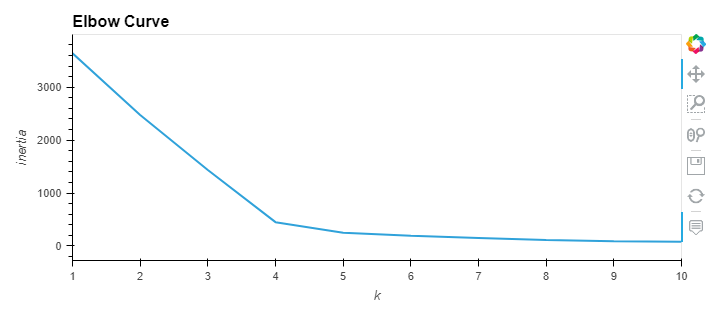

# Cryptocurrencies

## Analysis Overview
The purpose of this project is to use unsupervised machine learning to analyze a database of cryptocurrencies and create a report including the traded cryptocurrencies classified by group according to their features.
This classification report could be used by an investment bank to propose a new cryptocurrency investment portfolio to its clients.
We use the following methods for the analysis:
 - Preprocessing the database.
 - Reducing the data dimension using Principal Component Analysis.
 - Clustering cryptocurrencies using K-Means.
 - Visualizing classification results with 2D and 3D scatter plots.

## Resources
Data : [cryptoData.csv](Resources/crypto_data.csv)
Software :  [Python 3.7.7](), [Anaconda 1.9.12]()

## Results
Following the preprocessing and cleaning phase we have a total of 532 tradable cryptocurrencies.

### Clustering Cryptocurrencies using K-Means - Elbow Curve
We don't know what would be the output of the analysis so we are using unsupervised machine learning to identify clusters of the cryptocurrencies. We produced the elbow curve below using the K-Means method iterating on k values from 1 to 10.

